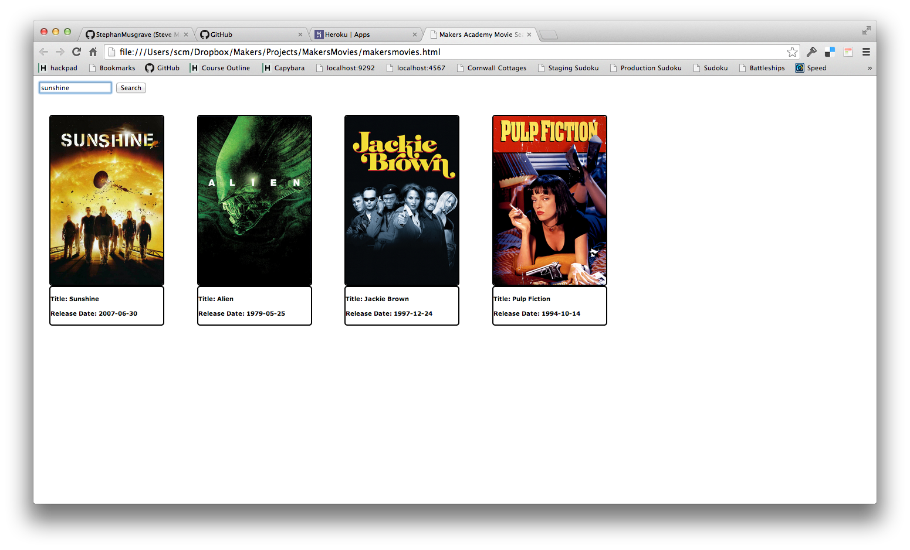

# MakersMovies
Week 7 project at [Makers Academy]

## Learning Objectives
A miniproject to incorporate themoviedb.org API into a webpage.

## How to run it

## Technologies used
|Technology                 |Used for                        |
|---------------------------|--------------------------------|
| Javascript |programming language for websites|
| Jquery |a cross-platform JavaScript library designed to simplify the client-side scripting of HTML
 |
| Mustache.js |a simple web template system |
| Underscore.js |a JavaScript library which provides utility functions for common programming tasks |
| HTML5 |HyperText Markup Language: the standard markup language used to create web pages |
| CSS3 |Cascading Style Sheets: a style sheet language used for describing the look and formatting of a document written in a markup language |
| [themoviedb API] |The Movie Database's application programming interface |
|Heroku |Deployment |

## Pairing Partners

[Steve Musgrave], [Daniel Le Dosquet-Bergquist]

[Steve Musgrave]:https://github.com/StephanMusgrave]
[Daniel Le Dosquet-Bergquist]:https://github.com/danldb
[themoviedb API]:http://www.themoviedb.org/documentation/api

## Further work to do

